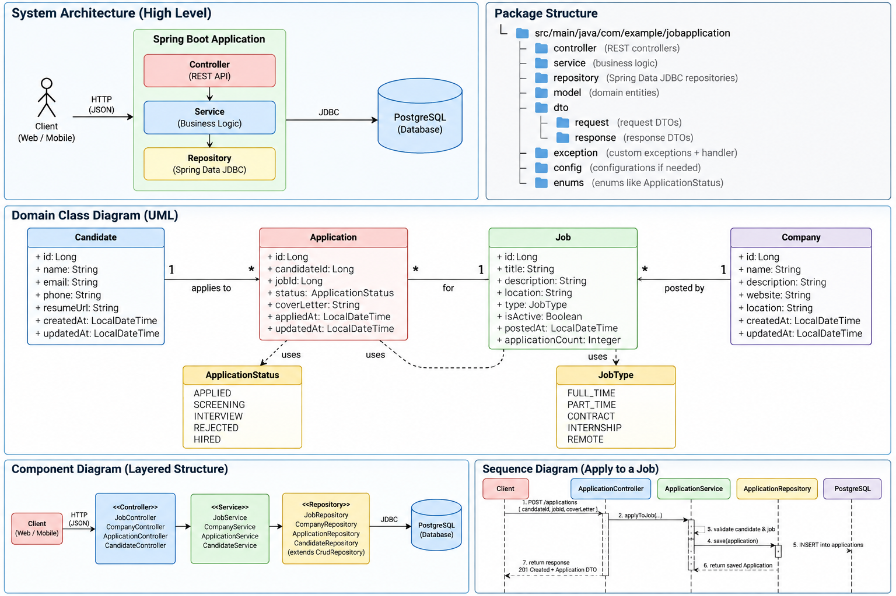

# Layer-based / package-by-layer architecture
```
job-application-api/
│
├── pom.xml
│
├── src/
│   ├── main/
│   │   ├── java/
│   │   │   └── com/
│   │   │       └── example/
│   │   │           └── jobapplication/
│   │   │               │
│   │   │               ├── JobApplicationApplication.java
│   │   │               │
│   │   │               ├── controller/
│   │   │               │   ├── CandidateController.java
│   │   │               │   ├── CompanyController.java
│   │   │               │   ├── JobController.java
│   │   │               │   └── ApplicationController.java
│   │   │               │
│   │   │               ├── service/
│   │   │               │   ├── CandidateService.java
│   │   │               │   ├── CompanyService.java
│   │   │               │   ├── JobService.java
│   │   │               │   └── ApplicationService.java
│   │   │               │
│   │   │               ├── repository/
│   │   │               │   ├── CandidateRepository.java
│   │   │               │   ├── CompanyRepository.java
│   │   │               │   ├── JobRepository.java
│   │   │               │   └── ApplicationRepository.java
│   │   │               │
│   │   │               ├── model/
│   │   │               │   ├── Candidate.java
│   │   │               │   ├── Company.java
│   │   │               │   ├── Job.java
│   │   │               │   └── Application.java
│   │   │               │
│   │   │               ├── dto/
│   │   │               │   ├── request/
│   │   │               │   │   ├── CreateCandidateRequest.java
│   │   │               │   │   ├── CreateCompanyRequest.java
│   │   │               │   │   ├── CreateJobRequest.java
│   │   │               │   │   └── CreateApplicationRequest.java
│   │   │               │   │
│   │   │               │   └── response/
│   │   │               │       ├── CandidateResponse.java
│   │   │               │       ├── CompanyResponse.java
│   │   │               │       ├── JobResponse.java
│   │   │               │       └── ApplicationResponse.java
│   │   │               │
│   │   │               ├── enums/
│   │   │               │   ├── ApplicationStatus.java
│   │   │               │   └── JobType.java
│   │   │               │
│   │   │               └── exception/
│   │   │                   ├── ResourceNotFoundException.java
│   │   │                   ├── DuplicateApplicationException.java
│   │   │                   ├── InvalidApplicationStateException.java
│   │   │                   └── GlobalExceptionHandler.java
│   │   │
│   │   └── resources/
│   │       ├── application.yml
│   │       └── schema.sql
│   │
│   └── test/
│       └── java/
│           └── com/
│               └── example/
│                   └── jobapplication/
│
├── docker-compose.yml
│
└── README.md
```
# feature oriented packaging
```
job-application-api/
│
├── pom.xml
│
├── src/
│   ├── main/
│   │   ├── java/
│   │   │   └── com/example/jobapplication/
│   │   │       │
│   │   │       ├── JobApplicationApplication.java
│   │   │       │
│   │   │       ├── candidate/
│   │   │       │   ├── controller/
│   │   │       │   ├── service/
│   │   │       │   ├── repository/
│   │   │       │   ├── model/
│   │   │       │   └── dto/
│   │   │       │
│   │   │       ├── company/
│   │   │       │   ├── controller/
│   │   │       │   ├── service/
│   │   │       │   ├── repository/
│   │   │       │   ├── model/
│   │   │       │   └── dto/
│   │   │       │
│   │   │       ├── job/
│   │   │       │   ├── controller/
│   │   │       │   ├── service/
│   │   │       │   ├── repository/
│   │   │       │   ├── model/
│   │   │       │   └── dto/
│   │   │       │
│   │   │       └── application/
│   │   │           ├── controller/
│   │   │           ├── service/
│   │   │           ├── repository/
│   │   │           ├── model/
│   │   │           └── dto/
│   │   │
│   │   └── resources/
│   │       └── application.yml
│   │
│   └── test/
│
└── docker-compose.yml
```
##  By extending CrudRepository, Spring Data JDBC provides the standard
// CRUD repository methods for Candidate, using Long as the ID type.
public interface CandidateRepository extends CrudRepository<Candidate, Long> {
}

CandidateRepository
│
│ extends
↓
CrudRepository<Candidate, Long>
│
│ provides contract for
↓
save()
findById()
findAll()
deleteById()
existsById()
count()
│
↓
Spring Data JDBC provides implementation
│
↓
JDBC → PostgreSQL

# Every Java object inherits:
toString()

from java.lang.Object.


Keep the inherited method:
Optional<Candidate> findById(Long id);

Then your service handles the Optional:
public Candidate getCandidateById(Long id) {

    return candidateRepository.findById(id)
            .orElseThrow(() ->
                    new RuntimeException("Candidate not found"));
}

Why does Spring use Optional?
Because this:
candidateRepository.findById(999);

might find nothing.
Instead of returning:
null

Spring Data gives you:
Optional<Candidate>

Conceptually:
findById(1)
↓
Optional[Candidate]

or:
findById(999)
↓
Optional.empty()

Then:
.orElseThrow(...)

says:
Give me the Candidate if it exists; otherwise throw this exception.

 **actual return type of each method**.

For `CrudRepository<Candidate, Long>`:

| Method | Return type | Meaning |
|---|---|---|
| `save(candidate)` | `Candidate` | Returns the saved entity |
| `findAll()` | `Iterable<Candidate>` | Returns all candidates |
| `findById(id)` | `Optional<Candidate>` | Candidate if found, otherwise empty |
| `deleteById(id)` | `void` | Deletes the candidate |
| `existsById(id)` | `boolean` | `true` if ID exists |
| `count()` | `long` | Number of candidates |

### 1. `save()`

```java
Candidate savedCandidate = candidateRepository.save(candidate);
```

Returns:

```text
Candidate
```

For a new candidate:

```text
Candidate object
      ↓
   save()
      ↓
   INSERT
      ↓
Candidate with generated ID
```

---

### 2. `findAll()`

```java
Iterable<Candidate> candidates = candidateRepository.findAll();
```

Returns:

```text
Iterable<Candidate>
```

Think:

> "Give me all Candidate objects."

You can loop over it:

```java
for (Candidate candidate : candidates) {
    System.out.println(candidate.getName());
}
```

---

### 3. `findById()`

```java
Optional<Candidate> result = candidateRepository.findById(1L);
```

Returns:

```text
Optional<Candidate>
```

Why `Optional`?

Because candidate `1` may or may not exist.

```text
findById(1)
     ↓
┌─────────────────┐
│ Candidate exists│ → Optional containing Candidate
└─────────────────┘

findById(999)
     ↓
┌──────────────────┐
│ Candidate absent │ → Optional.empty()
└──────────────────┘
```

As a beginner, you can handle it explicitly:

```java
Optional<Candidate> result = candidateRepository.findById(id);

if (result.isPresent()) {
    return result.get();
}

throw new RuntimeException("Candidate not found");
```

---

### 4. `deleteById()`

```java
candidateRepository.deleteById(1L);
```

Returns:

```text
void
```

Meaning:

> It doesn't return a value.

It performs:

```sql
DELETE FROM candidates WHERE id = 1;
```

---

### 5. `existsById()`

```java
boolean exists = candidateRepository.existsById(1L);
```

Returns:

```text
boolean
```

Possible values:

```text
true
false
```

Example:

```java
if (candidateRepository.existsById(id)) {
    System.out.println("Candidate exists");
}
```

---

### 6. `count()`

```java
long total = candidateRepository.count();
```

Returns:

```text
long
```

For example:

```text
5
```

means there are 5 candidates.

---

## Keep this mental cheat sheet

```text
CrudRepository<Candidate, Long>

save()        → Candidate
findAll()     → Iterable<Candidate>
findById()    → Optional<Candidate>
deleteById()  → void
existsById()  → boolean
count()       → long
```

And notice the pattern:

```text
READ multiple  → Iterable
READ one       → Optional
CREATE/UPDATE  → Entity
DELETE         → void
CHECK          → boolean
COUNT          → long
```

One small Java detail: `Long` in `CrudRepository<Candidate, Long>` is the **ID type**, while `long` returned by `count()` is the Java **primitive numeric type**. We'll cover primitives vs wrapper classes as they come up.


Exactly. **There are two common approaches**, and the key difference is **who owns the timestamp generation**.

| Approach | Who generates timestamp? | Typical mechanism |
|---|---|---|
| **Database-generated** | PostgreSQL | `DEFAULT CURRENT_TIMESTAMP` |
| **Spring Data auditing** | Spring Boot / Spring Data | `@CreatedDate`, `@LastModifiedDate` |

### 1. Database owns it

Your current schema:

```sql
created_at TIMESTAMP NOT NULL DEFAULT CURRENT_TIMESTAMP,
updated_at TIMESTAMP NOT NULL DEFAULT CURRENT_TIMESTAMP
```

Flow:

```text
Java
  ↓
Spring Data JDBC
  ↓
PostgreSQL
  ↓
CURRENT_TIMESTAMP
```

This is useful when **the database should be the source of truth**, regardless of which application writes to the database.

---

### 2. Spring Data auditing owns it

Entity:

```java
@CreatedDate
private LocalDateTime createdAt;

@LastModifiedDate
private LocalDateTime updatedAt;
```

And auditing is enabled.

Flow:

```text
Java
  ↓
Spring Data auditing
  ↓
timestamp generated by Spring
  ↓
Spring Data JDBC
  ↓
PostgreSQL
```

This is useful when you want Spring Data to manage entity lifecycle metadata automatically.

---

### The important distinction

Think of it as:

```text
DATABASE AUDITING
        ↓
"DB decides when this row was created/updated"

SPRING DATA AUDITING
        ↓
"Application framework decides when this entity was created/updated"
```

Neither is universally "better." **It's an architectural ownership decision.**

For **our project**, since you explicitly want PostgreSQL to own these timestamps, we'll keep:

```text
PostgreSQL → created_at
PostgreSQL → updated_at
```

and learn Spring Data auditing separately so you understand both patterns.


Why DTOs?
Right now our controller accepts the database entity directly:
@PostMapping
public Candidate createCandidate(@RequestBody Candidate candidate)

That means the client can potentially send fields that shouldn't be controlled by the client:
{
"id": 100,
"createdAt": "2020-01-01T00:00:00",
"updatedAt": "2020-01-01T00:00:00",
"name": "Neha",
"email": "neha@example.com"
}

That's not what we want.
The client should provide candidate input, while the entity represents database state.
So:
HTTP Request
↓
DTO
↓
Service
↓
Entity
↓
Repository
↓
Database


# Java / Spring Boot: JSON, DTO, Entity, and Database Mapping

## Core mental model

```text
JSON
  ↓ Jackson
Request DTO
  ↓ service/application mapping
Entity
  ↓ Spring Data JDBC
PostgreSQL
```

There are **different mappings at different boundaries**.

---

## 1. JSON → DTO

JSON:

```json
{
  "name": "Vikas Kumar",
  "email": "vikas@example.com",
  "resume_url": "https://example.com/vikas-resume"
}
```

DTO:

```java
public class CreateCandidateRequest {

    private String name;
    private String email;
    private String resumeUrl;
}
```

The names differ:

```text
JSON                    Java DTO
--------------------------------
resume_url        →     resumeUrl
```

Jackson converts JSON into the DTO.

### `@JsonProperty`

```java
@JsonProperty("resume_url")
private String resumeUrl;
```

This tells Jackson:

> JSON field `resume_url` maps to Java property `resumeUrl`.

`@JsonProperty` is about **JSON ↔ Java**. It has nothing to do with the database.

---

## 2. DTO → Entity

The DTO and database entity are separate objects.

The service maps between them:

```java
Candidate candidate = new Candidate();

candidate.setName(request.getName());
candidate.setEmail(request.getEmail());
candidate.setPhone(request.getPhone());
candidate.setResumeUrl(request.getResumeUrl());
```

Flow:

```text
CreateCandidateRequest
        ↓
      Service
        ↓
     Candidate
```

This separation prevents clients from directly controlling database fields such as:

```text
id
createdAt
updatedAt
```

---

## 3. Entity → Database

Java entity:

```java
private String resumeUrl;
```

PostgreSQL column:

```text
resume_url
```

Explicit mapping:

```java
@Column("resume_url")
private String resumeUrl;
```

This tells Spring Data JDBC:

> Java property `resumeUrl` is stored in database column `resume_url`.

`@Column` is about **Java Entity ↔ Database**. It has nothing to do with JSON.

---

## 4. The two annotations solve different problems

| Annotation | Boundary | Purpose |
|---|---|---|
| `@JsonProperty("resume_url")` | JSON → Java | Maps JSON field to Java property |
| `@Column("resume_url")` | Java → Database | Maps Java property to DB column |

They may contain the same string, but they operate at different layers.

---

## 5. Complete `resume_url` flow

Client sends:

```json
{
  "resume_url": "https://example.com/resume"
}
```

### JSON → DTO

```text
"resume_url"
     ↓
@JsonProperty("resume_url")
     ↓
CreateCandidateRequest.resumeUrl
```

### DTO → Entity

```java
candidate.setResumeUrl(request.getResumeUrl());
```

### Entity → Database

```text
Candidate.resumeUrl
      ↓
@Column("resume_url")
      ↓
candidates.resume_url
```

Complete flow:

```text
JSON
"resume_url"
      │
      │ @JsonProperty
      ▼
DTO
resumeUrl
      │
      │ service mapping
      ▼
Entity
resumeUrl
      │
      │ @Column
      ▼
PostgreSQL
resume_url
```

---

## 6. Go mental model

In Go, a JSON tag solves the JSON mapping problem:

```go
type CreateCandidateRequest struct {
    Name      string `json:"name"`
    Email     string `json:"email"`
    ResumeURL string `json:"resume_url"`
}
```

This is conceptually similar to:

```java
@JsonProperty("resume_url")
private String resumeUrl;
```

The database mapping is a separate concern.

So think:

```text
JSON mapping
    ↓
request DTO
    ↓
application mapping
    ↓
entity
    ↓
database mapping
    ↓
SQL table
```

---

## 7. Why use `@Column`?

Our database uses snake_case:

```text
resume_url
created_at
updated_at
```

Java uses camelCase:

```text
resumeUrl
createdAt
updatedAt
```

Explicit mapping makes the database relationship obvious:

```java
@Column("resume_url")
private String resumeUrl;

@Column("created_at")
private LocalDateTime createdAt;

@Column("updated_at")
private LocalDateTime updatedAt;
```

---

## 8. Why use `@JsonProperty`?

Our API request uses:

```json
"resume_url"
```

while Java uses:

```java
resumeUrl
```

So we explicitly tell Jackson:

```java
@JsonProperty("resume_url")
private String resumeUrl;
```

A global Jackson `snake_case` naming strategy is another option, but explicit annotations are useful when you want a mapping to be obvious or override the default convention.

---

## 9. Final mental model

Always ask:

> **Which two worlds am I mapping between?**

### JSON ↔ Java DTO

```java
@JsonProperty
```

### DTO ↔ Entity

Application/service code:

```java
candidate.setResumeUrl(request.getResumeUrl());
```

### Java Entity ↔ Database

```java
@Column
```

A single field can therefore have multiple representations:

```text
HTTP JSON
    │
    │ "resume_url"
    ▼
Request DTO
    │
    │ resumeUrl
    ▼
Entity
    │
    │ resume_url
    ▼
PostgreSQL
```

## One-line rule

> **`@JsonProperty` is for JSON mapping. `@Column` is for database mapping. DTO → Entity mapping is application/service code.**
# Global error handler common type
GlobalExceptionHandler
│
├── MethodArgumentNotValidException
│       → 400
│
├── ResourceNotFoundException
│       → 404
│
├── DuplicateEmailException
│       → 409
│
└── Exception
→ 500

CandidateNotFoundException ─┐
CompanyNotFoundException ───┼──→ ResourceNotFoundException handler → 404
JobNotFoundException ───────┘
```
GlobalExceptionHandler
│
├── MethodArgumentNotValidException
│       │
│       ├── getBindingResult()
│       ├── getFieldErrors()
│       ├── getField()
│       └── getDefaultMessage()
│                ↓
│              400
│
├── ResourceNotFoundException
│       │
│       └── getMessage()
│                ↓
│              404
│
├── DuplicateEmailException
│       │
│       └── getMessage()
│                ↓
│              409
│
└── Exception
│
├── getMessage() / getCause() → logging
│
└── generic response
↓
500
```

| Exception | Information we need | Important methods | HTTP | Response |
|---|---|---|---:|---|
| `MethodArgumentNotValidException` | Validation failures | `getBindingResult()` → `getFieldErrors()` → `getField()`, `getDefaultMessage()` | **400** | status + message + errors |
| `ResourceNotFoundException` | Resource not found | `getMessage()` | **404** | status + message |
| `DuplicateEmailException` | Email conflict | `getMessage()` | **409** | status + message |
| `Exception` | Unexpected internal failure | `getMessage()` / `getCause()` for logging | **500** | status + generic message |


```
Exception
↓
GlobalExceptionHandler
│
├── MethodArgumentNotValidException
│       → 400
│
├── ResourceNotFoundException
│       → 404
│
├── ConflictException
│       → 409
│
├── DataIntegrityViolationException
│       → 409
│
└── Exception
→ 500
↓
ApiErrorResponse
```

MethodArgumentNotValidException
→ 400 Validation failed

ResourceNotFoundException
→ 404 Candidate not found

ConflictException
→ 409 Business conflict

DataIntegrityViolationException
→ 409 Data conflict

Exception
→ 500 Internal server error

DataIntegrityViolationException
↓
Database says:
"this operation violates a DB constraint"


ConflictException
↓
Our application says:
"this operation violates a business rule"


Yes. The most important thing is to stop thinking of testing as “different annotations” and instead understand **what boundary each test is trying to prove**.

For your Spring Boot project, we currently have **three meaningful levels**:

```text
                    COMPLETE SYSTEM
                         │
              ┌──────────┴──────────┐
              │                     │
       Integration Test        Unit Test
              │                     │
        real dependencies       fake dependencies
              │
              ▼
        Controller
              ↓
          Service
              ↓
        Repository
              ↓
        PostgreSQL
```

## 1. Unit Test — "Does this piece of code work correctly?"

### Ultimate purpose

**Test one unit of business logic in isolation.**

In your project:

```text
CandidateService
      ↓
Mock CandidateRepository
      ↓
      ❌ Database
```

We used Mockito to fake the repository.

For example:

```java
@Test
void shouldThrowExceptionWhenCandidateDoesNotExist() {

    when(candidateRepository.findById(999L))
            .thenReturn(Optional.empty());

    assertThrows(
            ResourceNotFoundException.class,
            () -> candidateService.getCandidateById(999L)
    );
}
```

We're asking:

> "If the repository tells my service that the candidate doesn't exist, does my service correctly throw `ResourceNotFoundException`?"

We're **not** asking:

- Does PostgreSQL work?
- Does Spring MVC work?
- Does JSON work?
- Does the repository query work?

Those aren't the responsibility of this test.

### Basic purpose

> **Verify the logic of one class/method independently.**

### Ultimate purpose

> **Find bugs in business logic quickly and cheaply without involving external systems.**

---

# 2. Controller / Web Layer Test — "Does HTTP reach my controller correctly?"

Your:

```java
@WebMvcTest(CandidateController.class)
```

tests the web layer.

Architecture:

```text
MockMvc
   ↓
Spring MVC
   ↓
Real CandidateController
   ↓
Mock CandidateService
   ↓
❌ Repository
❌ PostgreSQL
```

For example:

```java
mockMvc.perform(
        post("/candidates")
                .contentType(MediaType.APPLICATION_JSON)
                .content(requestJson)
)
.andExpect(status().isBadRequest());
```

We're asking:

> "When a client sends invalid JSON data to this endpoint, does Spring validation reject it correctly?"

Or:

```java
mockMvc.perform(
        get("/candidates/1")
)
.andExpect(status().isOk());
```

We're asking:

> "Does `GET /candidates/1` reach the controller and produce the expected HTTP response?"

### Basic purpose

> **Test the HTTP/API contract and controller behavior.**

Things you typically verify:

```text
URL
HTTP method
request body
JSON mapping
validation
status code
response JSON
exception → HTTP response
```

### Ultimate purpose

> **Make sure your API boundary behaves correctly for clients.**

It answers:

> "If a client talks to my API, does the web layer behave correctly?"

---

# 3. Integration Test — "Do the real components work together?"

This is what we just started doing.

```java
@SpringBootTest
@AutoConfigureMockMvc
```

Now:

```text
MockMvc
   ↓
REAL Controller
   ↓
REAL Service
   ↓
REAL Repository
   ↓
REAL Spring Data JDBC
   ↓
REAL PostgreSQL
```

For example:

```java
Candidate savedCandidate =
        candidateRepository.save(candidate);

mockMvc.perform(
        get("/candidates/" + savedCandidate.getId())
)
.andExpect(status().isOk());
```

This proves much more.

We're asking:

> "Can my actual application save a Candidate to PostgreSQL and then retrieve it through the actual HTTP endpoint?"

This catches things such as:

```text
Java Entity
     ↓
Spring Data JDBC
     ↓
SQL
     ↓
PostgreSQL
```

mapping problems.

It also catches:

```text
Flyway
DataSource
Repository
Service
Controller
Exception Handler
JSON serialization
```

integration problems.

### Basic purpose

> **Test that multiple real components work together correctly.**

### Ultimate purpose

> **Prove that an actual application workflow works end-to-end across component boundaries.**

---

# The easiest mental model

Think about your **car**.

### Unit test

Test the engine separately:

```text
Engine → Does it work?
```

You're not testing the wheels, brakes, steering, etc.

---

### Controller test

Test the steering wheel:

```text
Driver
  ↓
Steering wheel
  ↓
Does the car receive the steering command correctly?
```

You don't need the actual engine running.

---

### Integration test

Actually drive the car:

```text
Driver
 ↓
Steering
 ↓
Transmission
 ↓
Engine
 ↓
Wheels
 ↓
Road
```

You're checking whether the **parts work together**.

---

# In your Job Application API

Let's take:

```text
POST /candidates
```

### Unit test

```text
CandidateService
       ↓
Mock Repository
```

Question:

> Does `createCandidate()` correctly construct and save a Candidate?

---

### Controller test

```text
HTTP POST
   ↓
MockMvc
   ↓
CandidateController
   ↓
Mock Service
```

Question:

> Does the API correctly handle the HTTP request, validation, and response?

---

### Integration test

```text
HTTP POST
   ↓
MockMvc
   ↓
CandidateController
   ↓
CandidateService
   ↓
CandidateRepository
   ↓
PostgreSQL
```

Question:

> Does the **actual application workflow** work?

---

# Why do we need all three?

Because each catches a different class of bug.

Imagine this code:

```java
candidateRepository.save(candidate);
```

### Unit test

Could pass because Repository is mocked:

```text
Mock Repository
     ↓
"Yeah, I'll return the candidate."
```

But your actual repository might have a bad DB mapping.

Unit test won't know.

---

### Controller test

Could also pass:

```text
POST /candidates
     ↓
Controller
     ↓
Mock Service
     ↓
"Here's a candidate."
```

Still doesn't touch PostgreSQL.

---

### Integration test

Now:

```text
POST
 ↓
Controller
 ↓
Service
 ↓
Repository
 ↓
PostgreSQL
```

If your entity says:

```java
@Column("resume_url")
```

but your DB actually has:

```text
resume_link
```

the integration test can catch it.

---

# The trade-off

There is a very important relationship:

| Test | Speed | Isolation | Realism |
|---|---:|---:|---:|
| **Unit** | Very high | Very high | Low |
| **Controller/Web** | High | High | Medium |
| **Integration** | Lower | Low | High |

So you don't want to replace all unit tests with integration tests.

You use each where it makes sense.

---

# The testing pyramid

The overall philosophy is roughly:

```text
                 /\
                /  \
               /    \
              / E2E  \
             /--------\
            /          \
           / Integration\
          /--------------\
         /                \
        /   Unit Tests     \
       /____________________\
```

More specifically for your current project:

```text
                Few
                 ▲
                 │
          Integration
             Tests
                 │
        Controller Tests
                 │
          Many Unit Tests
                 ▼
```

Why?

Because unit tests are:

- fast
- cheap
- isolated
- easy to diagnose

Integration tests are:

- slower
- more expensive
- dependent on infrastructure
- broader
- but much more realistic

---

# And one more important distinction

There is a difference between **what you're testing** and **what tool you're using**.

For example:

### JUnit

JUnit is the **testing framework**.

It gives you:

```java
@Test
assertEquals(...)
assertThrows(...)
```

Basically:

> "Run this test and tell me whether it passes."

---

### Mockito

Mockito is for **creating fake dependencies**.

```java
CandidateRepository repository =
        Mockito.mock(CandidateRepository.class);
```

Basically:

> "Don't give me the real repository. Give me a fake one that I control."

---

### MockMvc

MockMvc is for **simulating HTTP requests**.

```java
mockMvc.perform(
    get("/candidates/1")
)
```

Basically:

> "Pretend a client sent this HTTP request to my Spring MVC application."

---

### `@SpringBootTest`

This tells Spring:

> "Start the real application context."

---

### `@WebMvcTest`

This tells Spring:

> "I only want the web/controller portion of the application."

---

# Your project, summarized

You can remember it like this:

```text
UNIT TEST
─────────
"Is my code logic correct?"

Mockito
   ↓
isolate class


CONTROLLER TEST
───────────────
"Does my HTTP API behave correctly?"

MockMvc
   ↓
test HTTP/controller


INTEGRATION TEST
────────────────
"Do my real components work together?"

SpringBootTest
   ↓
real application
   ↓
real PostgreSQL
```

And the **ultimate purpose of testing as a whole** is:

> **Give you confidence that changes to the code haven't broken the behavior the system is supposed to provide.**

That's the mental model you should carry into Spring Boot—and it maps almost perfectly to how you'd test a Go application with `testing`, mocked dependencies, `httptest`, and integration tests.


```
                    Spring Boot
                        │
                        ▼
                 Component Scan
                        │
        ┌───────────────┼────────────────┐
        ▼               ▼                ▼
 CandidateController CompanyController JobController
        │               │                │
        ▼               ▼                ▼
 CandidateService   CompanyService    JobService
        │               │                │
        ▼               ▼                ▼
 CandidateRepo      CompanyRepo       JobRepo
        │               │                │
        └───────────────┼────────────────┘
                        ▼
                    PostgreSQL
```

# what is component scan by spring boot?
Exactly. This is an important Spring concept. **Component scanning is basically how Spring discovers the classes that it should create and manage as Beans.**

## 1. What does `@SpringBootApplication` do?

Our main class is:

```java
@SpringBootApplication
public class JobApplicationApiApplication {

    public static void main(String[] args) {
        SpringApplication.run(
                JobApplicationApiApplication.class,
                args
        );
    }
}
```

`@SpringBootApplication` is a combination of several Spring annotations. The important one for your question is:

```java
@ComponentScan
```

Conceptually:

```text
@SpringBootApplication
        │
        ├── configuration
        ├── auto-configuration
        │
        └── component scanning
                  │
                  ▼
           find Spring components
```

---

# 2. What does component scanning actually do?

Your main class is here:

```text
com.example.jobapplicationapi
└── JobApplicationApiApplication.java
```

Spring starts scanning from:

```text
com.example.jobapplicationapi
```

and its subpackages.

So it discovers:

```text
com.example.jobapplicationapi
│
├── candidate
│   ├── controller
│   ├── service
│   ├── repository
│   └── ...
│
├── company
│   ├── controller
│   ├── service
│   ├── repository
│   └── ...
│
├── job
│   ├── controller
│   ├── service
│   ├── repository
│   └── ...
│
└── exception
```

**But Spring doesn't make every Java class a Bean.**

It looks for classes/interfaces that Spring knows should be managed.

---

# 3. What are our components?

We currently have several different kinds.

## `@RestController`

For example:

```java
@RestController
public class CandidateController {
```

This tells Spring:

> This is a web controller. Create and manage it as a Spring Bean.

So:

```text
CandidateController
CompanyController
JobController
```

are Spring-managed components.

---

## `@Service`

For example:

```java
@Service
public class CandidateService {
```

Spring discovers it and creates the service object.

We have:

```text
CandidateService
CompanyService
JobService
```

So:

```text
@Service
     ↓
Spring Bean
```

---

## `@Configuration`

We have:

```java
@Configuration
@EnableJdbcAuditing
public class JdbcAuditingConfig {
}
```

That's also a Spring-managed configuration component.

It tells Spring how to configure something.

---

## Repository

This one is interesting.

We have:

```java
public interface CandidateRepository
        extends CrudRepository<Candidate, Long> {
}
```

There is **no `@Repository` annotation** on our interface.

Yet Spring creates a repository Bean for us.

Why?

Because **Spring Data JDBC detects repository interfaces and creates the implementation/proxy automatically.**

Conceptually:

```text
CandidateRepository
       │
       ▼
Spring Data JDBC
       │
       ▼
generated implementation/proxy
       │
       ▼
Spring Bean
```

So you don't write:

```java
class CandidateRepositoryImpl
```

yourself.

Spring Data does the work.

---

# 4. What about `Company.java` and `Job.java`?

This is an important distinction.

We have:

```java
@Table("companies")
public class Company {
```

and:

```java
@Table("jobs")
public class Job {
```

These are **not Spring components** in the same sense.

They are domain/data-mapping classes.

`@Table` tells Spring Data JDBC:

> This class represents a database table.

It does **not** mean:

> Create one `Company` object at application startup and put it into the Spring container.

Similarly, our DTOs:

```text
CreateCompanyRequest
UpdateCompanyRequest
CreateJobRequest
UpdateJobRequest
```

are not Spring Beans.

They are just request objects created when HTTP requests arrive.

---

# 5. Think of the Spring container

This is the mental model I want you to keep.

When your application starts:

```text
SpringApplication.run()
        │
        ▼
Spring Container
        │
        ├── CandidateController
        ├── CandidateService
        ├── CandidateRepository
        │
        ├── CompanyController
        ├── CompanyService
        ├── CompanyRepository
        │
        ├── JobController
        ├── JobService
        ├── JobRepository
        │
        └── JdbcAuditingConfig
```

The container manages these objects.

This is what **Dependency Injection** depends on.

---

# 6. Look at our `JobService`

We wrote:

```java
@Service
public class JobService {

    private final JobRepository jobRepository;
    private final CompanyRepository companyRepository;

    public JobService(
            JobRepository jobRepository,
            CompanyRepository companyRepository) {

        this.jobRepository = jobRepository;
        this.companyRepository = companyRepository;
    }
}
```

We didn't do:

```java
new JobRepository()
```

and we didn't do:

```java
new CompanyRepository()
```

Instead:

```text
Spring starts
     │
     ▼
Component scanning
     │
     ▼
Find JobService
     │
     ▼
JobService needs:
 ├── JobRepository
 └── CompanyRepository
     │
     ▼
Spring finds/creates those Beans
     │
     ▼
Spring calls JobService constructor
     │
     ├── passes JobRepository
     └── passes CompanyRepository
```

That's **Dependency Injection**.

---

# 7. Compare this with your Go mental model

In Go/Fiber, you might manually construct things:

```go
repo := NewJobRepository(db)

service := NewJobService(
    repo,
    companyRepo,
)

handler := NewJobHandler(service)

app.Post("/jobs", handler.Create)
```

You're explicitly building the dependency graph.

Spring moves much of that responsibility into the container:

```text
Spring Container

JobController
     ↓
JobService
     ↓
 ┌───────────────┐
 │               │
 ▼               ▼
JobRepository  CompanyRepository
```

You declare the dependencies:

```java
public JobService(
    JobRepository jobRepository,
    CompanyRepository companyRepository
)
```

and Spring resolves them.

**This is one of the biggest mental shifts when moving from Go to Spring.**

---

## 8. The simplest definition

If you remember only one thing:

> **Component scanning = Spring searching your application's packages for classes that are supposed to be managed by the Spring container.**

And:

> **A Spring Bean = an object whose lifecycle/dependencies are managed by Spring.**

For our project:

| Class | Spring-managed? | Why |
|---|---|---|
| `CandidateController` | ✅ | `@RestController` |
| `CompanyController` | ✅ | `@RestController` |
| `JobController` | ✅ | `@RestController` |
| `CandidateService` | ✅ | `@Service` |
| `CompanyService` | ✅ | `@Service` |
| `JobService` | ✅ | `@Service` |
| `CandidateRepository` | ✅ | Spring Data creates it |
| `CompanyRepository` | ✅ | Spring Data creates it |
| `JobRepository` | ✅ | Spring Data creates it |
| `JdbcAuditingConfig` | ✅ | `@Configuration` |
| `Candidate` | ❌* | Entity/data-mapping class |
| `Company` | ❌* | Entity/data-mapping class |
| `Job` | ❌* | Entity/data-mapping class |
| `CreateJobRequest` | ❌ | DTO |
| `UpdateJobRequest` | ❌ | DTO |

\*They're managed/mapped by Spring Data **when used**, but they're not ordinary application-level Spring Beans sitting in the container.

you don't need to manually register the controllers, services, or repositories in the main class.
Our main class can remain this simple:
package com.example.jobapplicationapi;

import org.springframework.boot.SpringApplication;
import org.springframework.boot.autoconfigure.SpringBootApplication;

@SpringBootApplication
public class JobApplicationApiApplication {

    public static void main(String[] args) {
        SpringApplication.run(
                JobApplicationApiApplication.class,
                args
        );
    }
}

Why?
Because this:
@SpringBootApplication

already tells Spring to:
Start application
↓
Configure Spring
↓
Component scan
↓
Find Controllers / Services / Configurations
↓
Find Spring Data repositories
↓
Create/manage Beans
↓
Wire dependencies

So we don't do this:
new CandidateController(...)
new CompanyController(...)
new JobController(...)

or:
registerController(...)
registerService(...)

Spring does that.


# Phase 4 — Application Module
The relationship is:
Candidate
│
│ candidate_id
↓
Application
↑
│ job_id
│
Job
│
└── company_id → Company

So an application essentially says:
Candidate X applied to Job Y with status Z.

1. Database migration
   Create:
   src/main/resources/db/migration/V4__create_applications_table.sql

Use:
CREATE TABLE applications (
id BIGSERIAL PRIMARY KEY,

    candidate_id BIGINT NOT NULL,

    job_id BIGINT NOT NULL,

    status VARCHAR(50) NOT NULL,

    applied_at TIMESTAMP NOT NULL DEFAULT CURRENT_TIMESTAMP,

    created_at TIMESTAMP NOT NULL DEFAULT CURRENT_TIMESTAMP,

    updated_at TIMESTAMP NOT NULL DEFAULT CURRENT_TIMESTAMP,

    CONSTRAINT fk_applications_candidate
        FOREIGN KEY (candidate_id)
        REFERENCES candidates(id),

    CONSTRAINT fk_applications_job
        FOREIGN KEY (job_id)
        REFERENCES jobs(id),

    CONSTRAINT uq_application_candidate_job
        UNIQUE (candidate_id, job_id)
);

Why these columns?
Column	Purpose
id	Application ID
candidate_id	Which candidate applied
job_id	Which job they applied to
status	Current application state
applied_at	When candidate applied
created_at	Record creation timestamp
updated_at	Last modification timestamp


The important constraint is:
UNIQUE (candidate_id, job_id)

This means one candidate cannot apply to the same job twice.
For example:
candidate_id = 5
job_id       = 10

can exist only once.


2. Application status
   For now, keeping it as String.
   Don't introduce Java enums yet.
   We'll first get CRUD working, just like we did with employmentType.
   Use values such as:
   APPLIED
   SCREENING
   INTERVIEW
   OFFER
   REJECTED
   WITHDRAWN

Later we'll decide whether an enum and stricter database constraint make sense.

# 6. Service
This is where this module gets interesting.
The service needs three repositories:
ApplicationRepository
CandidateRepository
JobRepository

Why?
Before creating:
Application(candidateId=1, jobId=5)

we should verify:
Candidate 1 exists?
↓
Job 5 exists?
↓
Create application