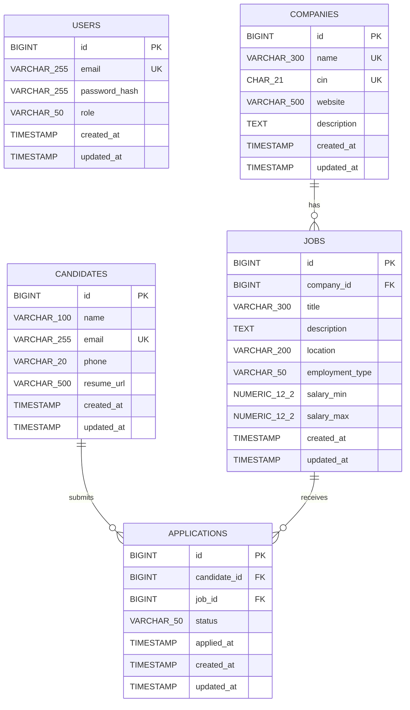
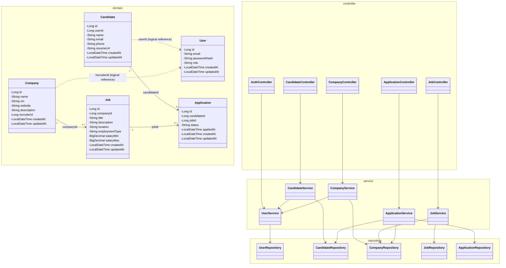

# Job Application API

A Spring Boot backend for a job application platform, with a React/Vite frontend.

## Architecture

- **Backend:** Spring Boot, Java 17
- **Database:** PostgreSQL
- **Persistence:** Spring Data JDBC
- **Migrations:** Flyway
- **Authentication:** JWT
- **Frontend:** React + TypeScript + Vite
- **API style:** REST

## Domain Model

The core domain consists of:

- **User** — authentication identity and role.
- **Candidate** — candidate profile and resume URL.
- **Company** — company profile owned logically by a recruiter.
- **Job** — job posting belonging to a company.
- **Application** — candidate's application to a job.

---

## ER Diagram

The ER diagram below reflects the **actual Flyway database schema**. The database currently has five tables: `users`, `candidates`, `companies`, `jobs`, and `applications`.



### Database relationship notes

- One **Company** can have many **Jobs**.
- One **Candidate** can submit many **Applications**.
- One **Job** can receive many **Applications**.
- `applications(candidate_id, job_id)` is unique, so a candidate cannot apply to the same job more than once.
- The current database schema does **not** define foreign keys from `candidates` or `companies` to `users`.
- The Java domain models contain `Candidate.userId` and `Company.recruiterId`; these are application-level references rather than database-enforced foreign keys.

---

## UML Class Diagram

This UML view represents the **current Java domain model and application layers**. It intentionally distinguishes application-level references from database foreign keys.



### Layering

```text
HTTP Request
     |
     v
Controller
     |
     v
Service
     |
     v
Repository
     |
     v
PostgreSQL
```

The services contain the application/business logic, while repositories handle persistence through Spring Data JDBC.

---

## Main API Areas

| Area | Base path | Purpose |
|---|---|---|
| Authentication | `/auth` | Register and login |
| Candidates | `/candidates` | Candidate profile |
| Companies | `/companies` | Company management |
| Jobs | `/jobs` | Job posting management |
| Applications | `/applications` | Applying and application-status management |

## Local Development

### Backend

PostgreSQL is expected on port `5432`.

Set the local environment variables required by the application:

```bash
export JWT_SECRET='your-local-secret-key-at-least-32-characters-long'
export SPRING_DATASOURCE_PASSWORD='your-postgres-password'
```

Then:

```bash
./mvnw spring-boot:run
```

Backend:

```text
http://localhost:8080
```

### Frontend

```bash
cd frontend
npm ci
npm run dev
```

Frontend:

```text
http://localhost:5173
```

During local development, Vite proxies API requests to the Spring Boot backend.

## Deployment

See [DEPLOYMENT.md](DEPLOYMENT.md) for the provider-neutral deployment configuration, environment variables, Docker setup, CORS configuration, and frontend/backend deployment requirements.
